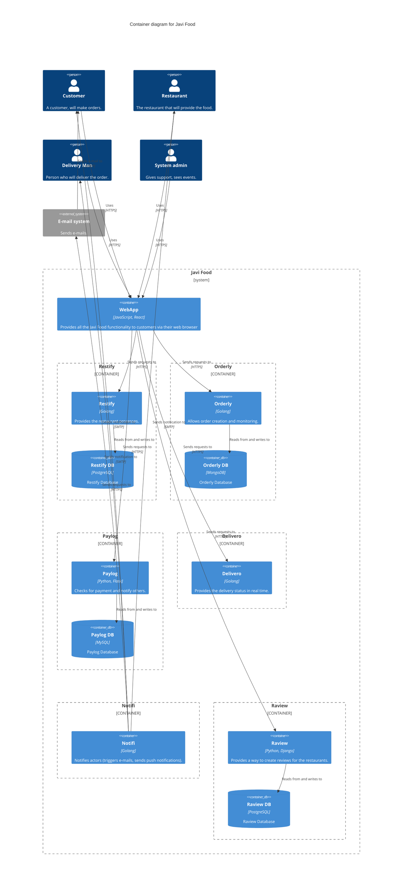

```mermaid
    C4Container
    %% What a mess, geez...
    title Container diagram for Javi Food

    Person(customer, "Customer", "A customer, will make orders.")
    Person(restaurant, "Restaurant", "The restaurant that will provide the food.")
    Person(deliveryMan, "Delivery Man", "Person who will deliver the order.")
    Person(admin, "System admin", "Gives support, sees events.")

    System_Ext(email, "E-mail system")

    Boundary(c1, "Javi Food") {
        Container(webApp, "WebApp", "JavaScript, React", "Provides all the Javi Food functionality to customers via their web browser")

        Container_Boundary(cRestify, "Restify") {
            Container(restify, "Restify", "Golang", "Provides the restaurant processes.")
            ContainerDb(restifyDb, "Restify DB", "PostgreSQL", "Restify Database")
            Rel(restify, restifyDb, "Reads from and writes to")
        }

        Container_Boundary(cOrderly, "Orderly") {
            Container(orderly, "Orderly", "Golang", "Allows order creation and monitoring.")
            ContainerDb(orderlyDb, "Orderly DB", "MongoDB", "Orderly Database")
            Rel(orderly, orderlyDb, "Reads from and writes to")
        }
       
        Container_Boundary(cPaylog, "Paylog") {
            Container(paylo, "Paylog", "Python, Flask", "Checks for payment and notify others.")
            ContainerDb(payloDb, "Paylog DB", "MySQL", "Paylog Database")
            Rel(paylo, payloDb, "Reads from and writes to")
        }
       
        Container_Boundary(cDelivero, "Delivero") {
            Container(delivero, "Delivero", "Golang", "Provides the delivery status in real time.")
        }
       
        Container_Boundary(cNotifi, "Notifi") {
            Container(notifi, "Notifi", "Golang", "Notifies actors (triggers e-mails, sends push notifications).")
        }
       
       Container_Boundary(cRaview, "Raview") {
            Container(raview, "Raview", "Python, Django", "Provides a way to create reviews for the restaurants.")
            ContainerDb(raviewDb, "Raview DB", "PostgreSQL", "Raview Database")
            Rel(raview, raviewDb, "Reads from and writes to")
        }
       
    }

    System_Ext(email, "E-mail system", "Sends e-mails.")

    Rel(customer, webApp, "Uses", "HTTPS")
    Rel(restaurant, webApp, "Uses", "HTTPS")
    Rel(deliveryMan, webApp, "Uses", "HTTPS")
    Rel(admin, webApp, "Uses", "HTTPS")

    Rel(email, customer, "Sends e-mail to", "SMTP")

    Rel(webApp, restify, "Sends requests to", "HTTPS")
    Rel(webApp, orderly, "Sends requests to", "HTTPS")
    Rel(webApp, paylo, "Sends requests to", "HTTPS")
    Rel(webApp, raview, "Sends requests to", "HTTPS")
    Rel(webApp, delivero, "Sends requests to", "HTTPS")

    Rel(notifi, customer, "Sends notification to", "SMTP")
    Rel(notifi, restaurant, "Sends notification to", "SMTP")
    Rel(notifi, deliveryMan, "Sends notification to", "SMTP")

    Rel(notifi, email, "Sends requests to", "HTTPS")


```
