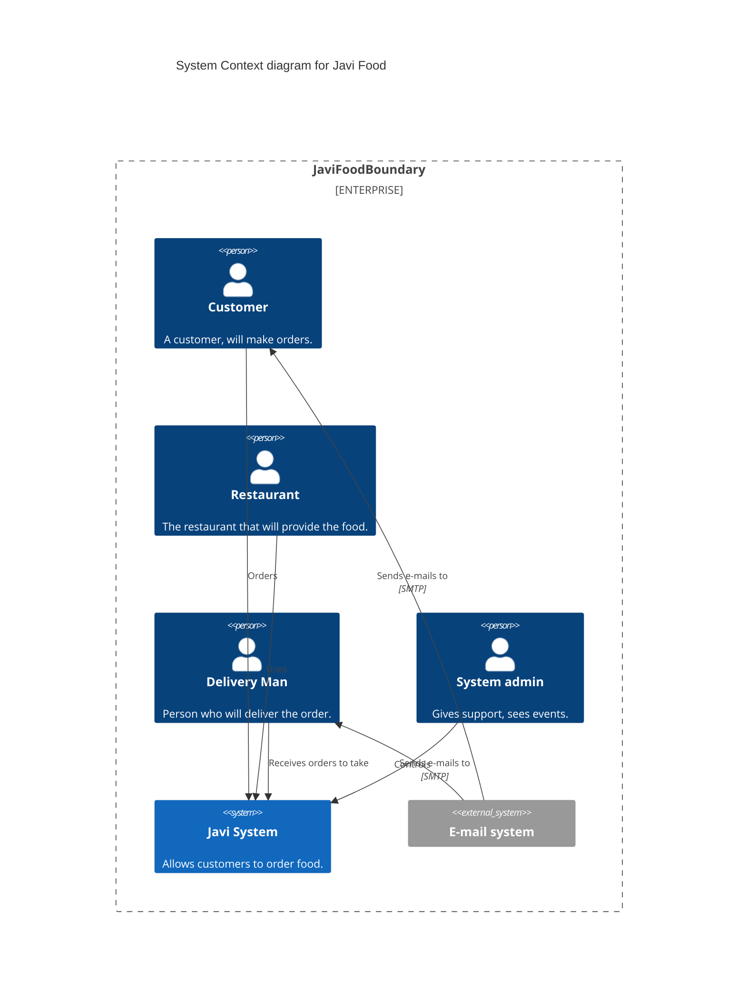

```mermaid
       C4Context
      title System Context diagram for Javi Food

      Enterprise_Boundary(b0, "JaviFoodBoundary") {
        Person(customer, "Customer", "A customer, will make orders.")
        Person(restaurant, "Restaurant", "The restaurant that will provide the food.")
        Person(deliveryMan, "Delivery Man", "Person who will deliver the order.")
        Person(admin, "System admin", "Gives support, sees events.")

        System(javiFood, "Javi System", "Allows customers to order food.")
        
        System_Ext(email, "E-mail system")
      }

      Rel(customer, javiFood, "Orders")
      Rel(restaurant, javiFood, "Uses")
      Rel(deliveryMan, javiFood, "Receives orders to take")
      Rel(admin, javiFood, "Controls")

      Rel(email, customer, "Sends e-mails to", "SMTP")
      Rel(email, deliveryMan, "Sends e-mails to", "SMTP")

      UpdateRelStyle(customerA, SystemAA, $textColor="blue", $lineColor="blue", $offsetX="5")
      UpdateRelStyle(SystemAA, SystemE, $textColor="blue", $lineColor="blue", $offsetY="-10")
      UpdateRelStyle(SystemAA, SystemC, $textColor="blue", $lineColor="blue", $offsetY="-40", $offsetX="-50")
      UpdateRelStyle(SystemC, customerA, $textColor="red", $lineColor="red", $offsetX="-50", $offsetY="20")

      UpdateLayoutConfig($c4ShapeInRow="3", $c4BoundaryInRow="1")
```
